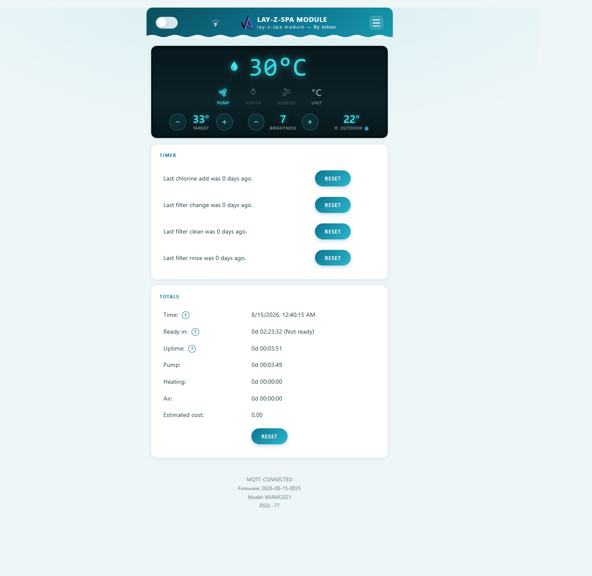
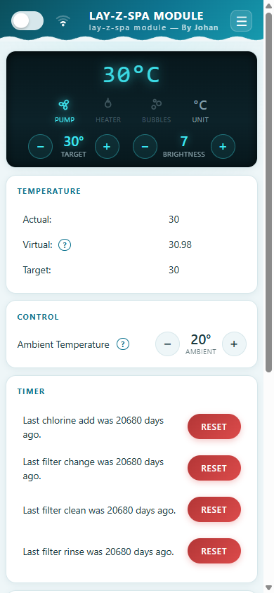
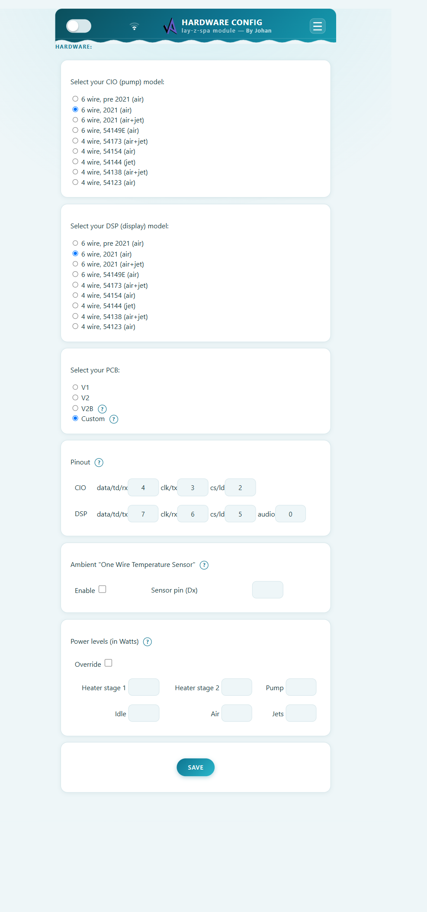

WiFi-remote-for-Bestway-Lay-Z-SPA
=================================
ESP8266 hack to use as WiFi remote control for Bestway Lay-Z-Spa Whirlpools (including 2021 year models)  

Check out what is new i the release notes. (Link in the right column on this page - release version) 
Also see the new [language support](README2.md) pulled into this rep by @dodemodexter

---

## Custom build — By Johan (2026)

This copy of the project is customized for a **Bestway Miami 2021** (6-wire, square connector), hand-wired without PCB per the D1-mini tutorial: CIO data/clk/cs on **D4/D3/D2**, DSP on D7/D6/D5, audio on D0. That hardware config is the firmware default and is preloaded in `Code/data_base/hwcfg.json`, so a filesystem flash no longer loses it.

What's different from upstream:

- **Redesigned home screen**: dark status panel showing the water temperature large (e.g. `30°C`), with tappable icon buttons for pump, heater (orange = heating, green = ready), bubbles, unit (°C/°F) and — where the model supports it — jets and take-control. The old switches section is gone.
- **Stepper controls** replace the sliders: `− / +` buttons for target temperature and display brightness right in the status panel, and for ambient temperature in the Control card.
- **"no data from pump"** message instead of the cryptic `abc` when the ESP has no communication with the pump yet.
- **MQTT config save fix** (password placeholder no longer blocks saving) and a WiFi signal icon in the header.
- **OTA is the default upload method** (`pio run -t upload`, espota to the device IP, password `esp8266`). Individual web files can be updated without a filesystem flash via the upload page.

| Home (desktop) | Home (mobile) | Hardware config |
|---|---|---|
|  |  |  |

---
Latest code found in [Development branch](https://github.com/visualapproach/WiFi-remote-for-Bestway-Lay-Z-SPA/tree/development_v4)
Build instructions and more: [Read the manual](bwc-manual.pdf) 
Check out releasenotes by clicking the release version to the right on this page. 

- [Features](#features)
- [BOM](#bom)
- [Web Interface](#web-interface)
- [WiFi Module / Pump](#wifi-module--pump)
- [Schematics](#schematics)
- [Installation](#installation)
- [Installation (Alternative)](#installation-alternative)
- [Problems?](#problems)

---

> #### Disclaimer
> As mentioned, this is a hack. If anything breaks it is your fault.

> #### Caution
> Pull out the mains plug before modifying hardware, or you can die!

> #### Donate
> If you like this project, please consider a donation. [Buy me a coffee](https://paypal.me/TLandahl), thanks!

#### Features
- Control buttons, watch the temperature and get current states from your browser.
- Custom text on the SPA pump display.
- Custom sound instead of just beeping is possible.
- OTA: Update firmware "over the air". Super convenient when mounted inside the pump.
- Simple to build. No hardware changes needed on the SPA pump. Just remove the display, disconnect the 6- or 4-pin ribbon cable and plug it into this device.
- Timer for chlorine addition and filter change. Hit the button on the web interface and it will count the days for you. (@Bankaifan)
- Electricity cost estimation and more..
- MQTT support! Now you can control the SPA from Home Assistant, OpenHab etc. (@faboaic, @877dev)
- Schedule events like heater on/off at specific dates, with repeat functionality.
- Listen to input signal on one pin and trigger a signal on another pin on desired events. For instance let solar panels turn on/off heater.

#### BOM
- ESP8266 NodeMCU 1.0 **(NOT for ESP32)**
- 8 channel bidirectional level converter
- 6 or 4 pin male header (0.1 in spacing) or better: JST-SM Housing Connector
- 6 or 4 pin female header (JST-SM Housing Connector)
see build instructions for more info.

#### Web Interface
See the up-to-date screenshots of the customized interface in the [Custom build](#custom-build--by-johan-2026) section above.

#### WiFi Module / Pump
 

#### Schematics
It's in this project [PCB_V2B](https://oshwlab.com/visualapproach/bestway-wireless-controller-2_copy)
Open the PCB tab and go to menu Fabrication, Gerber files. Order the PCB_V2B.

#### Installation
Build instructions and more: [Instructions](bwc-manual.pdf)
Technical details in the [Documentation](bwc_docs.xlsx).

@misterpeee's wife made and shared this case for 3d printing https://github.com/visualapproach/WiFi-remote-for-Bestway-Lay-Z-SPA/discussions/265#discussion-4062382 but it's for the PCB_V1 which is deprecated. Latest PCB is PCB_V2B.

#### Problems?
Read the [FAQ](https://github.com/visualapproach/WiFi-remote-for-Bestway-Lay-Z-SPA/discussions/46), other [discussions](https://github.com/visualapproach/WiFi-remote-for-Bestway-Lay-Z-SPA/discussions) and current [issues](https://github.com/visualapproach/WiFi-remote-for-Bestway-Lay-Z-SPA/issues).
